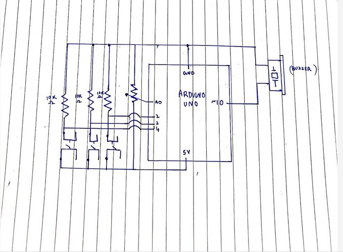

# Assignment 9
## Make a musical instrument using at least one digital sensor (switch, either momentary or toggle) and at least one analog sensor (photoresistor, potentiometer, or distance measuring sensor)

For Assignment 9, I wanted to make a musical instument that could atleast play a complete octave. I achieved this using 3 buttons and then splitting an octave over those 3 buttons. I did this by making 3 arrays of 3 notes each and then using the potentiometer to switch between these 3 arrays. This meant that it can play every note from C4 to D5(a complete octave, plus an extra note!). Using this I can play almost all nursery rhymes and songs that use base notes, and not sharp or flats. In the video below, you can see me perform Twinkle Twinkle Little Star 

Schematic:

Video:

I didn't have any major diffiuclties in this week's assignment since it was just a modification of the last week's assignment. But it was fun to explore the tone function and explore how music works based on frequency and pitch as opposed to the the last time where I was using just a simple analogWrite() function to produce a single note. 
