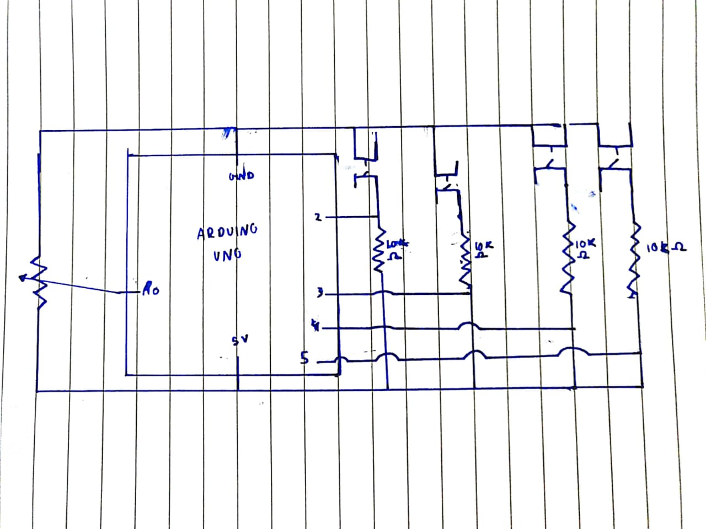

# Assignment 10
## Make a simple game that involves some kind of communication between Arduino and Processing. Document as before.

For Assignment 10, I made an external controller for my midterm game, which was an astroid collision game. It features 4 buttons and a potentiometer. Each button corresponds to a movement direction which controls the spaceship. The potentiometer is used to control the speed of the movement of the spaceship.

Schematic:

Video:

For this project, I just wanted to figure out the basics of serial communicaiton so rather than making a whole new game, I focussed on spendiong my time understanding communication between arduino and processing. It was a little challenging to figure out what information was going where but the rewatching the class and going through some arduino documentation really helped. 
