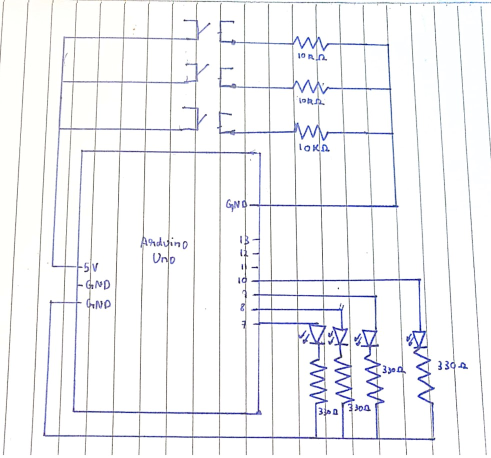

# Assignment 7 - BACACA Road
## Using at least three momentary switches (often called buttons), and at least three LEDs, create a puzzle that can be solved by pressing the buttons. Each switch must not simply turn on a corresponding LED.Using at least three momentary switches (often called buttons), and at least three LEDs, create a puzzle that can be solved by pressing the buttons. Each switch must not simply turn on a corresponding LED.

For Assignment 7, my puzzel is named Bacaca Road, named after a road in the Philipenes. It has 4 LEDs and 3 buttons. The player is supposed to press the 3 buttons in a specific order to win. If the buttons are pressed in the correct order, all the leds flash to indicate a win. If not, the red led blinks to indicate a loss. To restart, the reset on the arduino board can be used. 

Schematic:

Video:

