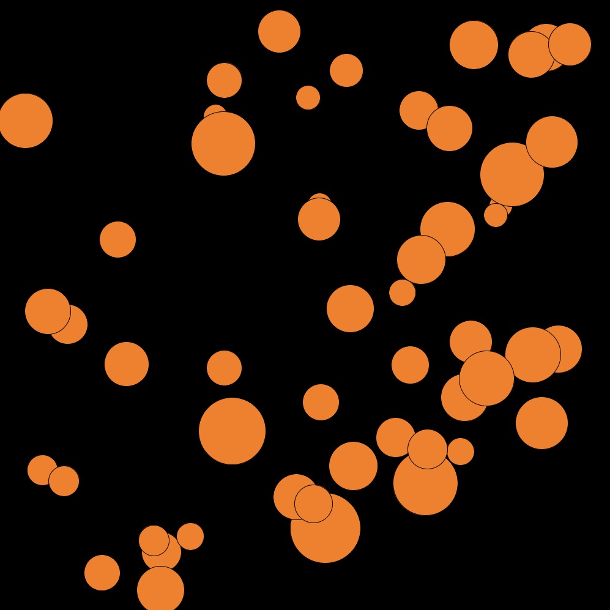

# Assignment 4
## Create either a data visualization or a generative text.

[Link](https://www.kaggle.com/abcsds/pokemon) for dataset

For Assignment 4, I visualized this dataset called Pokedex which is a compliation of various attributes of all Pokemons throughout history

 

Having been a fan of Pokemon since childhood, it was an obvious choice to do something with the Pokedex. In this program, the user is displayed an initial list of all the Pokemon types.
Then the user is asked to enter the type they want to display the data of. The circles created are based on the Health Points of each character of that particular type. The higher 
the HP, the larger the circle. The colours of the circle also changes with the type selected and is based on the official pokemon colour scheme

In terms of difficluties and what I found interesting, it was fun to figure out a way to take an input from the user. At the time of this submission, I couldn't figure out how to 
display the corresponding data of each Pokemon when the mouse is hovered on the circle( I figured out a way to do it with classes but not without it)
