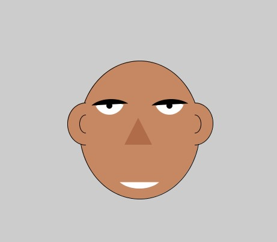

# IntroToIM
## Repository for Intro to IM, Fall 2020

#### Assignment 1:

For Assignment 1, I took a simple approach to make a face(clearly not mine), using basic shapes like Ellipse, Arc, lines etc. I also tried to use functions as much as possible to make the code more readable

