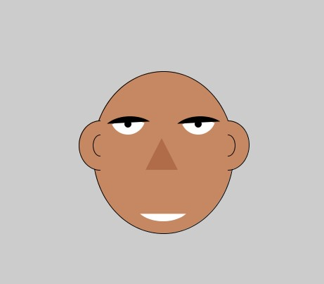

# Assignment1
## Make a self portrait using Processing

For Assignment 1, I tried to make a simple face using basic shapes like arcs, ellipses, lines etc. This was the end result:

I guess the only difficulty, more of an incnvenience, was trying to figure out coordinates to allign everything. For eg, I still don't know if the triangle for the nose I made is in the center of the face or not. Apart from that, it was pretty fun experimenting with the shapes
