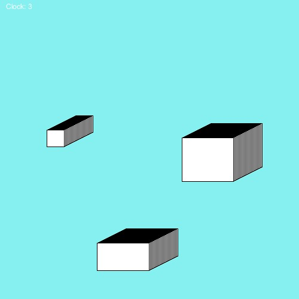

# Assignment 2
## Make a simple work of art using loops in Processing

For Assignment 2, I tried to give a modern and artistc touch to an object all of us use - a clock:

The above "clock" displays as many "tailed-rectangles" as the number of seconds on the system clock. It might not be the most practical but it is defintely the coolest clock out there

What I found interesting was how sensitive loops can be. I was playing around with the for loop that regulated the "tails" of the rectangles. And a slight change of that
value from 1 to 1.1 resulted in gaps between that tail. I didn't realise that even that difference of 0.1 can have such an impact due to being added over time
