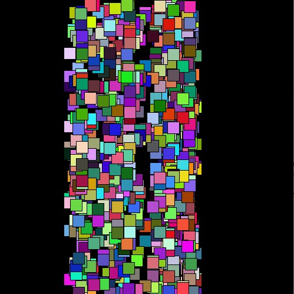
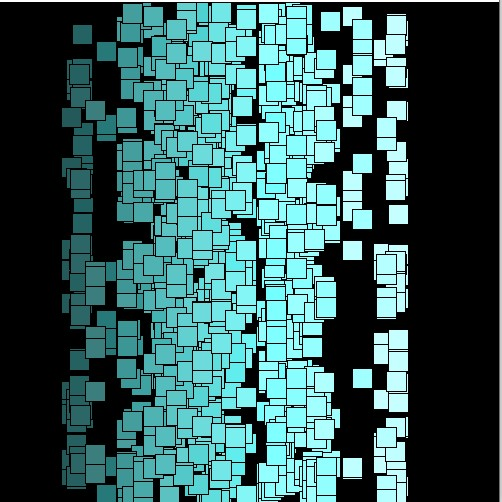

# Assignment 3
## Create either an artwork or a game using Object Oriented Programming.

For Assignment 3, rather than doing something super fancy, I wanted to study the effects of Perlin Noise on a simple piece of code

As shown in the above picture, both the placement and the colour scheme of the sqaures are regulated by Perlin Noise. It is interesting to see how the noise function 
in this case differs from the random function. Where the random dunction can produce any colour on the spectrum, when genereated the colour using the noise function, it
displays a more natural flow of color where the it flows naturally from extremelly dark blue(or any other colour) to extremely pale blue(or any other colour)

The only difficulty I had with this assignment was that for some reason I was unable to type the correct spelling of "Sqaure" all throughout the code and had to correct 
it at the end
