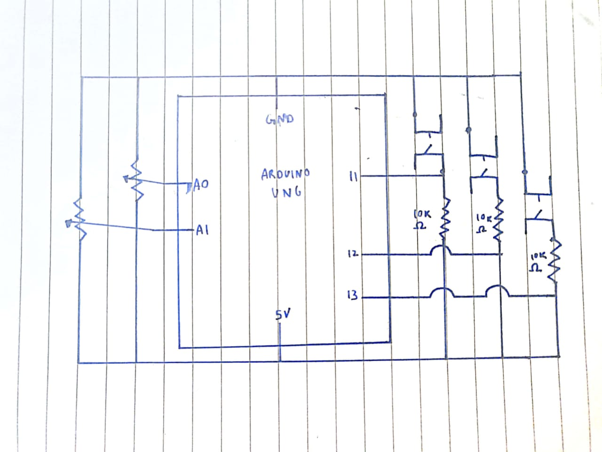
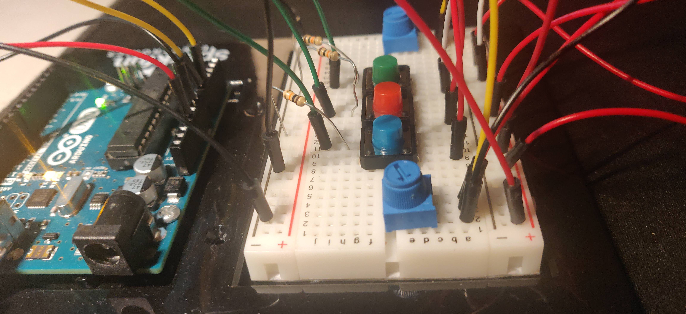
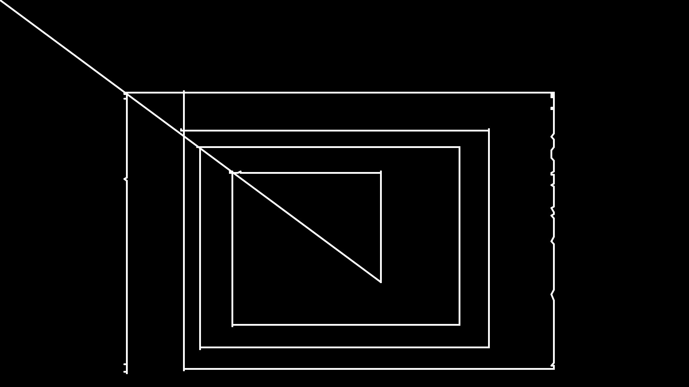

# Final Project
## Make a project that involves both arduino and processing

For the Final Project, I was inspired by this toy called Etch-a-Sketch that I used to play with as a kid. It featured 2 knobs, one controlling the up-down movement and the other controlling the lef-right movement of the drawing cursor. I wanted to recreate a digital version of thsi with arduino serving as the input space and processing as the drawing space. 

### Objective:
Draw and have fun while taking screenshots to show-off your drawing skills!

### Implementation:
I used 2 potentiometers to mimick the knobs of the original Etch-a-Sketch with one controlling the up-down movement and the other controlling the left-right movement of the drawing cursor. This allows for drawing of almost everything 2d, be it using straight, diagonal or squigly lines :). It also has 3 buttons with each serving a different purpose. The 1st, blue button clears the drawing space on pressing it. The 2nd, red button takes a screenshot and saves it as a jpg image. It also names it based on the frame count. For this, I used the in-built saveFrame() function. The 3rd green button is used to change the stroke color of the drawing cursor. Each time the button is pressed, it canges the color to a new, random one

### Circuit:
I know we are supposed to draw all the input components on one side but since this particular circuit was all input I drew potentiometers on one side and buttons on the other.

### Drawing Samples:
I am not that good at drawing but I tried to make some basic shapes and make it seem "artistic" by adding some squigly lines and color variations. 

### Problems and observations:
One of the problems I had was how to actually draw based on the input of the user. It was relatively easy to get that input. But to draw, i experimented with several ways. I initially tried to use the point function to draw dots. But this gave me staggered lines, which could be seen as an artistic look but I wanted to stay true to the original toy. So I ended up using the line function to draw a line from 2 preset values, in this case 0,0 to the position given by the 2 potentiometers. After every input cycle, I simply change those 2 preset values as the values given by the user and the endpoints as new input.
For example,
Cycle 1
Starting Value -> (0,0)
User Input Value -> (50,60)

Cycle 2
Starting Value -> (50,60)
User Input Value -> (30,160)

Cycle 3
Starting Value -> (30,160)
User Input Value -> (127,69)

This way I can draw seamless lines based on user input
