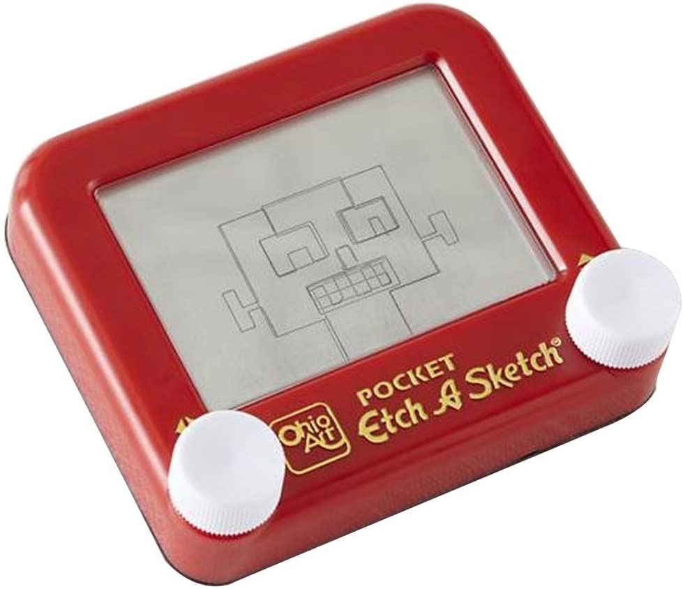
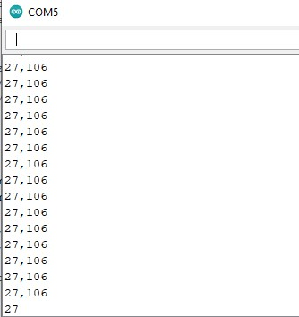
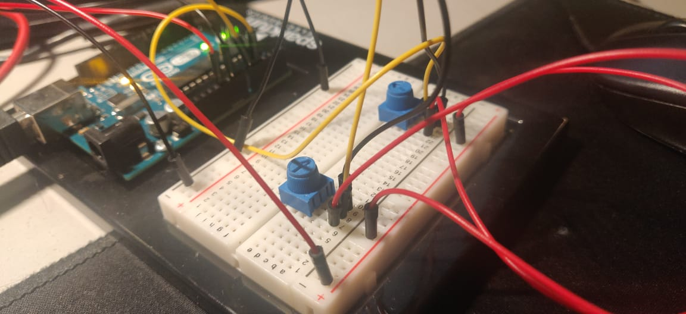
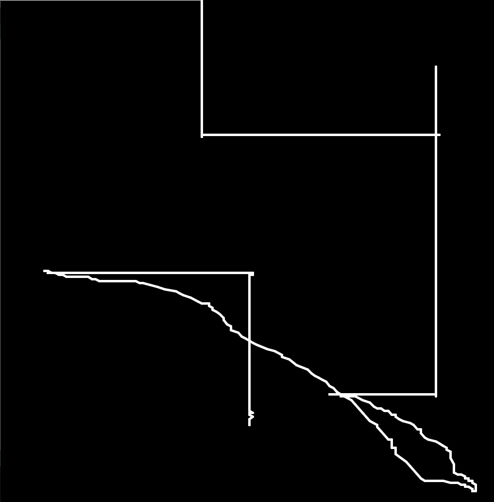
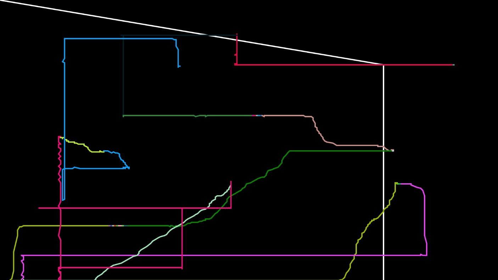

# Journal for the Final Project

### Preliminary Concept

 I would like to recreate those drawing tablets called Etch-a-sketch where the user uses 2 knobs to move a pointer across the slate and thus draw any shape. I plan to use 2 potentiometers(will have to borrow one lol) along with some buttons that provide addition functionality like clearing the drawing space and maybe changing colours and/or saving a screenshot of the image

### Inspiration:

#### 8th December:
It took some time but I finally was able to get a second potentiometer for my project. These 2 potentiometers will act as knobs to draw on the drawing space. Today I just worked on the Arduino side of things with making the circuit and inputting values from both the potentiometers into Serial.

#### 9th December:
Morning Update: I made the actual drawing space in processing where it reads and cleans the input from arduino and draws lines corresponding to the values of the 2 potentiometers to "draw" based on user input. As you can see in the image below, this allows for both straight and squigly lines and diagonals. I now need to add buttons to add more functionality like taking a screenshot or clearing the drawing space.

Evening Update: I added the button functionality. The 1st button(blue) is for clearing the drawing space. For this, I simple redefine the background color. The 2nd, red button takes and saves a screenshot of the canvas. I use the saveFrame function. By default this function gives the screenshot a file name based on the frame count. By using "####.jpg", it saves the file based on the frame number and a jpg. This means that each file name is automatically unique. The 3rd, green button when pressed changes the stroke color being used to draw to a new, random color. This was also the point where I realized I never uploaded the processing code.

