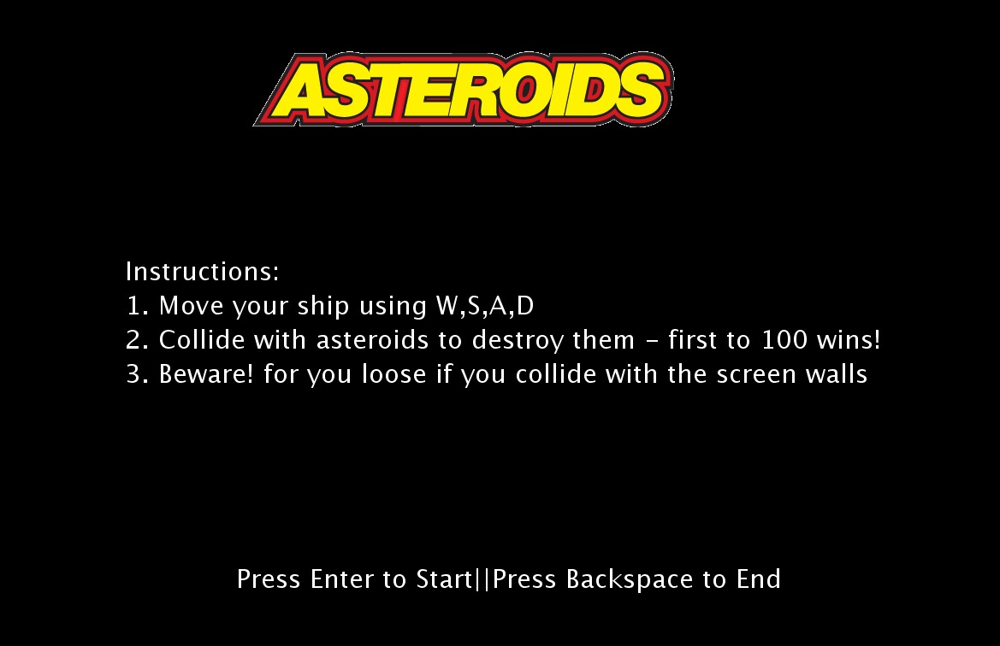
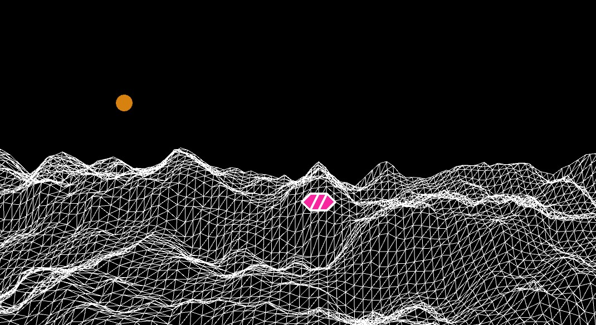
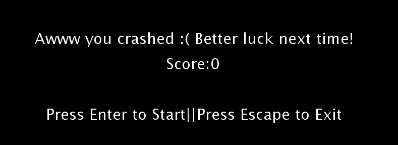

# Midterm Project
## Make a game using everything you have learned so far

For the midterm project, I was inspired the original atari game called asteroids where you are a spaceship and you have to move around while destroying asteroids. I started by drawing a simple grid adn then rotating it in P3D to give it a 3d effect. Further, I used the perlin noise function to pull up each vertex of the grid towards the y-axis based on the value generated by the noise function and mapped to a lower and upper bound. Then I used the begin and endshape to cut the grid into various triangles to smooth out the curves of this terrain. These functions where also used to create the space ship. Further, with keybinds to navigate the game, the logo of the original atari game and a retro soundtrack, the game was complete.

### Objective:
Destroy as many asteroids as possible without dying. The user dies when the spaceship collides with the walls. The user wins when they destroy 100 asteroids.

#### Start Screen(with Instructions)

#### A demo game stage

#### End Screen( a similar message is displayed when the user wins the game)

One of the major difficulties I had with this game was figuring out the nesting of various functions and classes. It was confusing how and where to call each function to make the game run smoothly and without an hiccups. I also had fun learning about p3D. I had trouble keeping track of the coordinate shift caused by using p3D. But the processing documentation helped a lot with that. All of the earlier projects in the semester used either one or the other concepts but it was interesting to put all of these concepts together to make a complete programme. 

## Please dowload add unzip the zip file uploaded above to run the game
