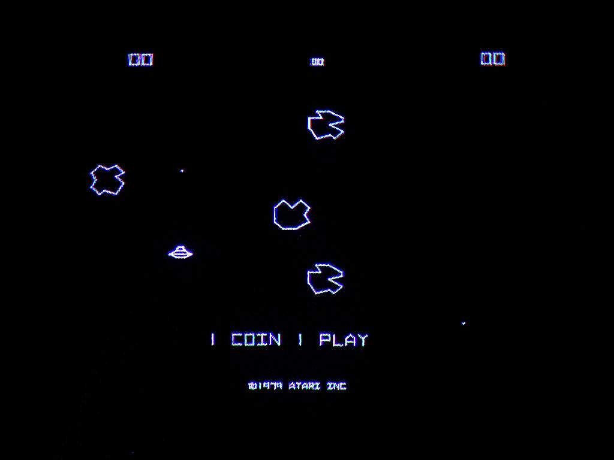

# Journal for the Midterm Project

### Idea: 
For the midterm project, I intent to recreate the astroid destroyer game. It will have a ship, flying over an endlessley genereated terrain, and controled by the users' keyboard inputs(W,S,A,D). The game would ideally end with the user winning if they reach a certain score or the user loosing if the collide with the bondaries of the screen

### Objective:
Destroy as many astroids as possible without dying

### Inspiration:

#### 24th October:
Since I was working on the project before making the journal, I added the progress I made so far. It inlcudes an infinite terrain generated using perlin noise and a spaceship of sorts. Both of these were made using beginShape-endShape. The terrain is made by making a grid in 2d, roating it by 60 degrees in 3d and then pulling up certain vertices of the grid by the y axis. The amount each vertice needs to be pulled up by is determined by perlin noise function which is mapped to a lower and upper bound value of the y offset. I also implemented the movement of the ship using W,S,A,D keys

#### 25th October:
I added  a system loop to start the program and call all other functions. I also made the astroid class which generates "astroids" which are simply circles at a random position. It also has a collision function which calculates the distance between the astroid's position and the ship's position. If the distance is less than 30 pixels(the astroid is a circle of size 30), it detects the collsion and generates a new astroid. It will eventually also increment the score.

#### 26th October:
Morning Update: Today I made the start and end screen, comprising of the original Asteroid game Logo. I also added keybinds to the system loop so that the user can navigate the game and restart it without having to end or restart the entire programme. Today was interesting since it helped me to think about the nesting of various classes and their functions while calling everything from the main system loop.

Evening Update: I added a soundtrack to give the game that retro arcade vibe. Also added the end game scenario where if you crash with any of the walls, you loose. If your score reaches 100, you win the game! Also commented and organized the whole code, while deleting all the debugging print statements and test cases scattered all around the programme
